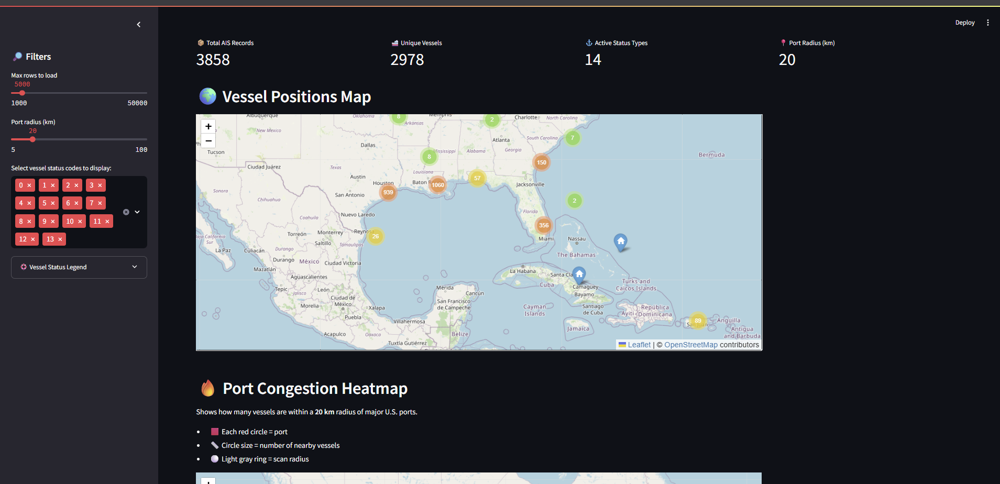

# Maritime Trade Route Risk Analyzer

A Python-based platform for analyzing and predicting maritime trade route disruptions using geospatial data, machine learning, and database-driven vessel tracking.

## 🌍 Features

- 🚢 Real-time vessel tracking on interactive maps
- ⚓ Port congestion analysis based on vessel clustering

## 🛠 Tech Stack

- **Python**: GeoPandas, Folium, Scikit-learn, Pandas, SQLAlchemy
- **Visualization**: Folium, Streamlit
- **Database**: SQLite (with SQLAlchemy ORM)
- **Data Source**: Kaggle: https://www.kaggle.com/datasets/marsalanakhtar/ais-data-for-ships

## 🚀 Setup Instructions

### 1. Clone the Repository

```bash
git clone https://github.com/SarahSchoonmaker/maritime-trade-analyzer.git
cd maritime-trade-analyzer
```

## Setup

```bash
python -m venv venv
source venv/bin/activate  # On Windows: source .venv/Scripts/activate

pip install -r requirements.txt
```

## Results Output Sample


